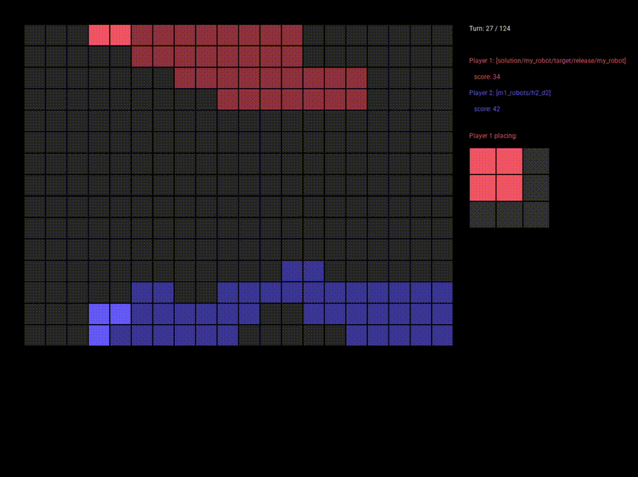

# filler visualizer
A visualizer for the Filler game project, built using Rust and SDL2.

## Prerequisites
- Rust and Cargo installed. You can get them from [rustup.rs](https://rustup.rs/).
- SDL2 library installed on your system. For macOS, you can use Homebrew:
- Or install and configure the sdl2 library for your OS.

```bash
brew install sdl2
```

Set env variable for the sdl library if required.
```bash
export LIBRARY_PATH="/opt/homebrew/lib"
export CFLAGS="-I/opt/homebrew/include"
```

## Usage
Run the docker provided by the filler project and generate a game_log.txt.
The visualizer reads the game log file for the visuals.

Run the visualizer with the path to the game log file:
```bash
cargo run ../logs/game_log.txt
```

A window will open showing the field and the current piece given.
On the right, you will see the players with their path and scores.
- press `Arrow Right` to go to the next step
- press `Arrow Left` to go to the previous step
- you can hold the arrow keys to fast forward or rewind

## Demo
[](demo.gif)